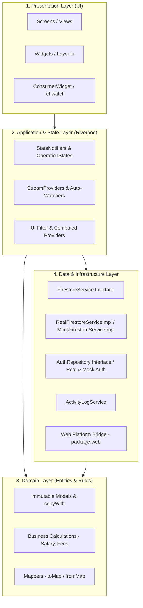

# Software Architecture & Design Patterns

## 1. Architectural Overview

The **SAEED PHYSIO & REHAB CLINIC** web application follows a **Layered Architecture** organized using a **Feature-First (Modular)** structure, heavily inspired by **Clean Architecture** and **Domain-Driven Design (DDD)** principles.

The codebase enforces strict separation of concerns across 4 distinct layers:
1. **Presentation Layer (UI)**: Screens, widgets, layout wrappers, and UI state consumers (`ConsumerWidget`).
2. **Application / State Layer (Controllers & Notifiers)**: Riverpod `StateNotifier` classes managing asynchronous operations, error states, and UI filters.
3. **Domain Layer (Models & Business Rules)**: Immutable data models, entity relationships, and core business calculation rules (e.g. commission logic, fee waivers).
4. **Data / Infrastructure Layer (Services & Repositories)**: Firebase SDK adapters, abstract service interfaces, real-time snapshot listeners, and browser platform utilities.



---

## 2. Directory Structure & File Organization

The `lib/` directory is structured as follows:

```
lib/
├── core/                               # Cross-cutting foundational modules
│   ├── constants/                      # Global styling & text constants
│   │   ├── app_colors.dart             # Medical color palette & gradients
│   │   ├── app_sizes.dart              # Spacing, padding, and layout breakpoints
│   │   ├── app_strings.dart            # Clinic branding and UI copy
│   │   └── payment_status.dart         # Payment status constants & parsers
│   ├── services/                       # Core service contracts & implementations
│   │   ├── firebase_service.dart       # Firebase app initialization & mode detection
│   │   ├── firestore_service.dart      # Abstract FirestoreService & Real/Mock impls
│   │   └── activity_log_service.dart   # System-wide audit trail logger
│   ├── theme/                          # Material Design 3 theme configurations
│   │   └── app_theme.dart              # Typography, inputs, buttons, and card styles
│   ├── utils/                          # Cross-platform utilities & validators
│   │   ├── local_storage.dart          # Conditional export dispatcher
│   │   ├── local_storage_stub.dart     # Mobile/Desktop storage stub
│   │   ├── local_storage_web.dart      # Web HTML5 localStorage via package:web
│   │   └── validators.dart             # Form validation rules (email, phone, etc.)
│   └── widgets/                        # Shared UI components
│       └── sidebar_widget.dart         # MainLayout shell, responsive collapsible drawer
│
├── models/                             # Domain data models & JSON/Firestore mappers
│   ├── activity_log_model.dart         # Audit log entity
│   ├── dashboard_model.dart            # Analytics aggregates & revenue chart points
│   ├── massage_chair_bill_model.dart   # Massage chair billing record
│   ├── patient_model.dart              # Comprehensive patient & consultation entity
│   ├── reassignment_log_model.dart     # Temporary patient coverage audit log
│   ├── session_model.dart              # Clinical treatment & therapy log
│   └── user_model.dart                 # Staff & Admin credentials and commission profile
│
├── routes/                             # Navigation & URL routing
│   └── app_router.dart                 # GoRouter declarations, ShellRoute, and RBAC guards
│
├── features/                           # Feature-Driven Application Modules
│   ├── auth/                           # Authentication & Sign-in
│   │   ├── data/auth_repository.dart   # Real & Mock Auth implementations
│   │   ├── providers/auth_provider.dart# AuthNotifier & AuthState
│   │   └── screens/login_screen.dart   # Login screen & Demo mode bypass
│   ├── dashboard/                      # Executive Clinic Overview
│   │   └── screens/
│   │       ├── dashboard_screen.dart   # Metrics cards, fl_chart graphs, salary cards
│   │       └── splash_screen.dart      # Startup branding & session restoration
│   ├── patients/                       # Patient Registry & EHR
│   │   ├── providers/patients_provider.dart # Streams, operation notifiers, search
│   │   └── screens/
│   │       ├── patients_screen.dart    # Searchable list & filter tabs
│   │       ├── patient_details_screen.dart # EHR history & cumulative dues summary
│   │       └── add_patient_screen.dart # Registration form & duplicate phone warning
│   ├── sessions/                       # Therapy Treatment Sessions
│   │   ├── providers/sessions_provider.dart # Sessions stream & operation state
│   │   └── screens/
│   │       ├── sessions_screen.dart    # Session timeline & payment toggles
│   │       └── add_session_screen.dart # Clinical procedures & charges entry
│   ├── billing/                        # Invoices, Dues & Massage Chair Accounts
│   │   ├── providers/massage_chair_provider.dart # Chair bills stream & notifiers
│   │   └── screens/billing_screen.dart # Dues collection, fee waivers, chair billing
│   ├── reports/                        # Reporting, Document Generation & Audit
│   │   ├── providers/activity_logs_provider.dart # Audit logs stream
│   │   └── screens/
│   │       ├── reports_screen.dart     # PDF & DOCX generation, preview & sharing
│   │       └── activity_logs_screen.dart # Administrator audit history
│   └── staff/                          # Staff & Temporary Reassignment
│       ├── providers/
│       │   ├── staff_provider.dart     # Staff directory & Secondary App creation
│       │   └── reassignment_provider.dart # Transfer logic & auto-reversion watchdog
│       └── screens/
│           ├── staff_screen.dart       # Directory list, coverage tabs & soft-delete
│           └── add_edit_staff_screen.dart # Staff onboarding & commission setting
│
├── firebase_options.dart               # FlutterFire generated platform credentials
└── main.dart                           # App entrypoint & Riverpod ProviderScope setup
```

---

## 3. Key Design Patterns & Engineering Practices

### 3.1 Interface-Driven Service Architecture
All data services define an `abstract class` contract before implementation.

**Example**:
```dart
abstract class FirestoreService {
  Stream<List<PatientModel>> streamPatients({String? therapistId});
  Future<void> addPatient(PatientModel patient);
  Future<void> updatePatient(PatientModel patient);
  Future<void> deletePatient(String patientId);
  // ...
}
```
This enables zero-friction switching between live production Cloud Firestore ([`RealFirestoreServiceImpl`](file:///e:/repeat%20project/Physio%20Therapy%20Clinic%20Web%20App%205.0%20-%20Copy%2011/lib/core/services/firestore_service.dart#L39)) and offline demo simulation ([`MockFirestoreServiceImpl`](file:///e:/repeat%20project/Physio%20Therapy%20Clinic%20Web%20App%205.0%20-%20Copy%2011/lib/core/services/firestore_service.dart#L321)).

### 3.2 Immutability & Model Design
All models in `lib/models/` enforce immutability:
- All fields are marked `final`.
- Mutating entities is achieved exclusively via `copyWith(...)`.
- Bidirectional serialization with robust type checking:
  - `toMap()`: Serializes DateTime objects directly into Firestore native `Timestamp`.
  - `fromMap()`: Handles polymorphic date input types (`Timestamp`, `String`, `int`) defensively to prevent crashes caused by schema evolution or legacy records.

### 3.3 The Secondary Firebase App Pattern
To allow logged-in administrators to register new staff accounts without terminating their own session, [`StaffService.addStaff`](file:///e:/repeat%20project/Physio%20Therapy%20Clinic%20Web%20App%205.0%20-%20Copy%2011/lib/features/staff/providers/staff_provider.dart#L65) creates a isolated secondary Firebase App instance (`SecondaryApp`), creates the user, and signs out only the secondary app instance.

### 3.4 Soft-Delete vs. Atomic Cascade Delete
The application employs different deletion strategies based on data importance:
- **Patients**: Hard cascade deletion via `_firestore.batch()`. Purges the patient document, associated sessions, and massage chair bills atomically.
- **Staff**: Soft-delete via `status = 'Deleted'` and `isDeleted = true`. Guarantees that historical patient records, treatment notes, and revenue logs remain legally and clinically intact.

### 3.5 Automated Background Watchdogs
The application uses reactive providers to monitor clinical state in the background:
- [`autoReversionCheckerProvider`](file:///e:/repeat%20project/Physio%20Therapy%20Clinic%20Web%20App%205.0%20-%20Copy%2011/lib/features/staff/providers/reassignment_provider.dart#L282): Automatically inspects all active temporary patient assignments. When the `tempAssignmentEndDate` is reached, it automatically triggers `revertReassignment()`, moving the patient back to their primary therapist without requiring manual intervention.

### 3.6 Cross-Platform Web Storage Abstraction
Web browsers no longer recommend `dart:html` in modern Flutter. The codebase uses conditional compilation ([`local_storage.dart`](file:///e:/repeat%20project/Physio%20Therapy%20Clinic%20Web%20App%205.0%20-%20Copy%2011/lib/core/utils/local_storage.dart)) using `package:web` (`web.window.localStorage`) for Web and fallback stubs for other platforms.
