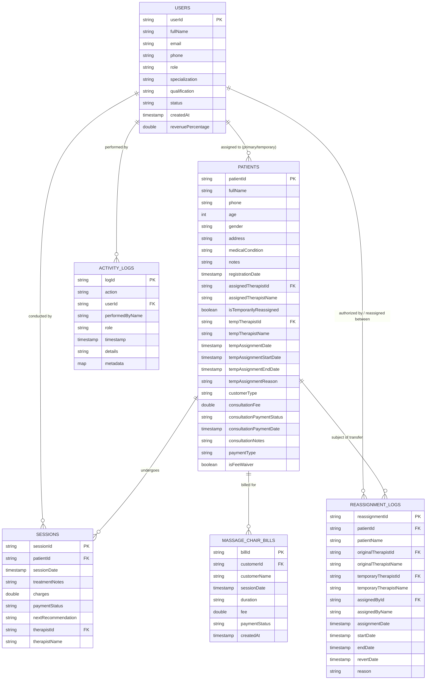

# Database Schema Documentation

## 1. Overview & Database Architecture

The **SAEED PHYSIO & REHAB CLINIC** management web application uses **Google Cloud Firestore** (`cloud_firestore: ^5.6.0`) as its primary NoSQL document database.

The data layer is abstracted behind the [`FirestoreService`](file:///e:/repeat%20project/Physio%20Therapy%20Clinic%20Web%20App%205.0%20-%20Copy%2011/lib/core/services/firestore_service.dart#L10) interface with two concrete runtime implementations:
- [`RealFirestoreServiceImpl`](file:///e:/repeat%20project/Physio%20Therapy%20Clinic%20Web%20App%205.0%20-%20Copy%2011/lib/core/services/firestore_service.dart#L39): Connects to live Firebase Firestore using real-time snapshots (`.snapshots()`) and batched operations.
- [`MockFirestoreServiceImpl`](file:///e:/repeat%20project/Physio%20Therapy%20Clinic%20Web%20App%205.0%20-%20Copy%2011/lib/core/services/firestore_service.dart#L321): High-fidelity in-memory reactive mock service for offline testing, demos, or when Firebase credentials are not yet configured.

The active implementation is dynamically injected at runtime via the Riverpod provider [`firestoreServiceProvider`](file:///e:/repeat%20project/Physio%20Therapy%20Clinic%20Web%20App%205.0%20-%20Copy%2011/lib/core/services/firestore_service.dart#L765) based on [`FirebaseService.isFirebaseAvailable`](file:///e:/repeat%20project/Physio%20Therapy%20Clinic%20Web%20App%205.0%20-%20Copy%2011/lib/core/services/firebase_service.dart#L7).

---

## 2. Entity-Relationship & Data Flow Diagram

---

## 3. Collections & Document Specifications

### 3.1 `users` Collection
- **Collection Path**: `/users/{userId}`
- **Document ID**: Firebase Auth UID (`request.auth.uid`).
- **Data Model**: [`UserModel`](file:///e:/repeat%20project/Physio%20Therapy%20Clinic%20Web%20App%205.0%20-%20Copy%2011/lib/models/user_model.dart#L3)
- **Description**: Stores profile, credentials metadata, clinic roles, and commission percentage for Clinic Admins and Therapists.

| Field | Firestore Type | Dart Type | Nullable | Default | Description |
| :--- | :--- | :--- | :--- | :--- | :--- |
| `userId` | `string` | `String` | No | `''` | Unique identifier (matches Firebase Auth UID). |
| `fullName` | `string` | `String` | No | `''` | Full display name of the staff member. |
| `email` | `string` | `String` | No | `''` | Work email address. |
| `phone` | `string` | `String` | No | `''` | Contact phone number. |
| `role` | `string` | `String` | No | `'Therapist'` | User authorization role: `'Admin'` or `'Therapist'`. |
| `specialization` | `string` | `String` | No | `''` | Clinical specialty (e.g. `'Orthopedic Spine'`, `'Pediatric Rehab'`). |
| `qualification` | `string` | `String` | No | `''` | Academic/professional credentials (e.g. `'DPT, CMPT'`). |
| `status` | `string` | `String` | No | `'Active'` | Account status: `'Active'`, `'Inactive'`, or `'Deleted'`. |
| `createdAt` | `timestamp` | `DateTime` | No | `DateTime.now()` | Account creation date. |
| `revenuePercentage` | `number` (double) | `double` | No | `0.0` | Salary commission cut from conducted sessions (e.g., `30.0` for 30%). |
| `isDeleted` | `boolean` | `bool?` | Yes | `false` | Soft-delete flag set by Admin to deactivate account while preserving history. |

---

### 3.2 `patients` Collection
- **Collection Path**: `/patients/{patientId}`
- **Document ID**: Custom business identifier formatted as `PT-001` or generated via `PT-` prefix + UUID.
- **Data Model**: [`PatientModel`](file:///e:/repeat%20project/Physio%20Therapy%20Clinic%20Web%20App%205.0%20-%20Copy%2011/lib/models/patient_model.dart#L3)
- **Description**: Central registry for clinical therapy patients and massage chair walk-in clients.

| Field | Firestore Type | Dart Type | Nullable | Default | Description |
| :--- | :--- | :--- | :--- | :--- | :--- |
| `patientId` | `string` | `String` | No | Required | Unique patient code (e.g. `PT-001` or UUID-based). |
| `fullName` | `string` | `String` | No | Required | Patient full name. |
| `phone` | `string` | `String` | No | Required | Contact phone number (also used in duplicate checks). |
| `age` | `number` (int) | `int` | No | `0` | Age in years. |
| `gender` | `string` | `String` | No | `'Male'` | Gender (`'Male'`, `'Female'`). |
| `address` | `string` | `String` | No | `''` | Residential address. |
| `medicalCondition` | `string` | `String` | No | `''` | Primary diagnosis/ailment (e.g. `'Lumbar Spondylosis'`). |
| `notes` | `string` | `String` | No | `''` | Clinical assessment and history notes. |
| `registrationDate` | `timestamp` | `DateTime` | No | Required | Initial clinic registration timestamp. |
| `assignedTherapistId` | `string` | `String?` | Yes | `null` | UID of the primary assigned therapist. |
| `assignedTherapistName` | `string` | `String?` | Yes | `null` | Cached name of the primary assigned therapist. |
| `isTemporarilyReassigned` | `boolean` | `bool?` | Yes | `false` | `true` if patient is temporarily on loan to another therapist. |
| `tempTherapistId` | `string` | `String?` | Yes | `null` | UID of the substitute therapist. |
| `tempTherapistName` | `string` | `String?` | Yes | `null` | Cached name of the substitute therapist. |
| `tempAssignmentDate` | `timestamp` | `DateTime?` | Yes | `null` | Timestamp when reassignment was executed. |
| `tempAssignmentStartDate`| `timestamp` | `DateTime?` | Yes | `null` | Planned start date for coverage. |
| `tempAssignmentEndDate` | `timestamp` | `DateTime?` | Yes | `null` | Expiration date of temporary coverage. |
| `tempAssignmentReason` | `string` | `String?` | Yes | `null` | Reason for transfer (e.g., `'Annual Leave'`). |
| `customerType` | `string` | `String` | No | `'therapy'` | Service category: `'therapy'` or `'massage_chair'`. |
| `consultationFee` | `number` (double) | `double?` | Yes | `0.0` | Initial doctor consultation fee in PKR. |
| `consultationPaymentStatus` | `string` | `String?` | Yes | `'Unpaid'` | Payment status: `'Paid'`, `'Unpaid'`, or `'Fee Waiver'`. |
| `consultationPaymentDate` | `timestamp` | `DateTime?` | Yes | `null` | Date when consultation fee was cleared. |
| `consultationNotes` | `string` | `String?` | Yes | `null` | Specific notes regarding the doctor's initial consultation. |
| `paymentType` | `string` | `String?` | Yes | `'regular'` | Categorization: `'regular'` or `'feeWaiver'`. |
| `isFeeWaiver` | `boolean` | `bool?` | Yes | `false` | Flag indicating patient has a 100% charity/fee waiver. |

---

### 3.3 `sessions` Collection
- **Collection Path**: `/sessions/{sessionId}`
- **Document ID**: Custom identifier (e.g. `SE-101` or `SE-` + 5 character UUID).
- **Data Model**: [`SessionModel`](file:///e:/repeat%20project/Physio%20Therapy%20Clinic%20Web%20App%205.0%20-%20Copy%2011/lib/models/session_model.dart#L3)
- **Description**: Individual clinical therapy logs, treatments administered, charges, and settlement state.

| Field | Firestore Type | Dart Type | Nullable | Default | Description |
| :--- | :--- | :--- | :--- | :--- | :--- |
| `sessionId` | `string` | `String` | No | Required | Unique session code (e.g., `SE-101`). |
| `patientId` | `string` | `String` | No | Required | Foreign key to `patients.patientId`. |
| `sessionDate` | `timestamp` | `DateTime` | No | Required | Date and time the session was conducted. |
| `treatmentNotes` | `string` | `String` | No | `''` | Clinical procedure log (modalities, exercises, dry needling). |
| `charges` | `number` (double) | `double` | No | `0.0` | Billed fee for the therapy session in PKR. |
| `paymentStatus` | `string` | `String` | No | `'Unpaid'` | Status: `'Paid'`, `'Unpaid'`, or `'Fee Waiver'`. |
| `nextRecommendation`| `string` | `String` | No | `''` | Home exercise plan and next appointment advice. |
| `therapistId` | `string` | `String?` | Yes | `null` | UID of therapist who delivered the session. |
| `therapistName` | `string` | `String?` | Yes | `null` | Cached name of therapist for reporting and billing. |

---

### 3.4 `massage_chair_bills` Collection
- **Collection Path**: `/massage_chair_bills/{billId}`
- **Document ID**: Custom identifier (e.g. `MCB-001` or `MCB-` + 5 character UUID).
- **Data Model**: [`MassageChairBillModel`](file:///e:/repeat%20project/Physio%20Therapy%20Clinic%20Web%20App%205.0%20-%20Copy%2011/lib/models/massage_chair_bill_model.dart#L3)
- **Description**: Billing records for automatic massage chair usage. Accessible only by Administrators.

| Field | Firestore Type | Dart Type | Nullable | Default | Description |
| :--- | :--- | :--- | :--- | :--- | :--- |
| `billId` | `string` | `String` | No | Required | Unique bill identifier (e.g., `MCB-001`). |
| `customerId` | `string` | `String` | No | Required | Foreign key referencing `patients.patientId`. |
| `customerName` | `string` | `String` | No | Required | Client display name. |
| `sessionDate` | `timestamp` | `DateTime` | No | Required | Date of the massage chair session. |
| `duration` | `string` | `String` | No | `''` | Duration of session (e.g. `'30 minutes'`, `'45 minutes'`). |
| `fee` | `number` (double) | `double` | No | `0.0` | Usage fee charged. |
| `paymentStatus` | `string` | `String` | No | `'Unpaid'` | Payment status: `'Paid'`, `'Unpaid'`, or `'Fee Waiver'`. |
| `createdAt` | `timestamp` | `DateTime` | No | Required | Billing creation timestamp. |

---

### 3.5 `reassignment_logs` Collection
- **Collection Path**: `/reassignment_logs/{reassignmentId}`
- **Document ID**: Generated format `RE-{timestamp}-{patientId}`.
- **Data Model**: [`ReassignmentLogModel`](file:///e:/repeat%20project/Physio%20Therapy%20Clinic%20Web%20App%205.0%20-%20Copy%2011/lib/models/reassignment_log_model.dart#L3)
- **Description**: Immutable audit record for temporary patient handovers between therapists, tracking origin, destination, validity window, and reversion status.

| Field | Firestore Type | Dart Type | Nullable | Default | Description |
| :--- | :--- | :--- | :--- | :--- | :--- |
| `reassignmentId` | `string` | `String` | No | Required | Unique record key `RE-{timestamp}-{patientId}`. |
| `patientId` | `string` | `String` | No | Required | Patient being temporarily transferred. |
| `patientName` | `string` | `String` | No | Required | Cached patient full name. |
| `originalTherapistId`| `string` | `String` | No | Required | Primary therapist UID. |
| `originalTherapistName`|`string` | `String` | No | Required | Primary therapist full name. |
| `temporaryTherapistId`|`string` | `String` | No | Required | Covering therapist UID. |
| `temporaryTherapistName`|`string` | `String`| No | Required | Covering therapist full name. |
| `assignedById` | `string` | `String` | No | Required | Admin UID who initiated the transfer. |
| `assignedByName` | `string` | `String` | No | Required | Admin display name. |
| `assignmentDate` | `timestamp` | `DateTime` | No | Required | Time transfer was initiated. |
| `startDate` | `timestamp` | `DateTime?` | Yes | `null` | Start date of temporary assignment. |
| `endDate` | `timestamp` | `DateTime?` | Yes | `null` | Planned expiration date. |
| `revertDate` | `timestamp` | `DateTime?` | Yes | `null` | Actual date patient was reverted to original therapist (`null` if active). |
| `reason` | `string` | `String?` | Yes | `null` | Administrative justification. |

---

### 3.6 `activity_logs` Collection
- **Collection Path**: `/activity_logs/{logId}`
- **Document ID**: Auto-generated document ID or `ACT-RE-{timestamp}`.
- **Data Model**: [`ActivityLogModel`](file:///e:/repeat%20project/Physio%20Therapy%20Clinic%20Web%20App%205.0%20-%20Copy%2011/lib/models/activity_log_model.dart#L3)
- **Description**: System-wide administrative audit trail logging all mutations across staff, patients, billing, and sessions.

| Field | Firestore Type | Dart Type | Nullable | Default | Description |
| :--- | :--- | :--- | :--- | :--- | :--- |
| `logId` | `string` | `String` | No | Required | Unique audit log ID. |
| `action` | `string` | `String` | No | Required | Action title (e.g. `'Patient Registered'`, `'Session Logged'`). |
| `userId` | `string` | `String` | No | Required | UID of the user who performed the operation. |
| `performedByName`| `string` | `String` | No | Required | Name of the operator. |
| `role` | `string` | `String` | No | Required | Role of operator at time of action (`'Admin'`, `'Therapist'`). |
| `timestamp` | `timestamp` | `DateTime` | No | Required | Precise UTC timestamp. |
| `details` | `string` | `String` | No | Required | Narrative details of the action. |
| `metadata` | `map` | `Map<String, dynamic>?` | Yes | `null` | Optional arbitrary JSON payload. |

---

## 4. Firestore Composite Indexes

Configured in [`firestore.indexes.json`](file:///e:/repeat%20project/Physio%20Therapy%20Clinic%20Web%20App%205.0%20-%20Copy%2011/firestore.indexes.json):

1. **Therapist Sessions Query**:
   - Collection Group: `sessions`
   - Fields: `therapistId` (ASCENDING), `sessionDate` (DESCENDING)
   - Usage: Powers therapist-specific session timeline in [`RealFirestoreServiceImpl.streamSessions`](file:///e:/repeat%20project/Physio%20Therapy%20Clinic%20Web%20App%205.0%20-%20Copy%2011/lib/core/services/firestore_service.dart#L176).

2. **Primary Assigned Patients Query**:
   - Collection Group: `patients`
   - Fields: `assignedTherapistId` (ASCENDING), `registrationDate` (DESCENDING)
   - Usage: Powers therapist patient roster in [`RealFirestoreServiceImpl.streamPatients`](file:///e:/repeat%20project/Physio%20Therapy%20Clinic%20Web%20App%205.0%20-%20Copy%2011/lib/core/services/firestore_service.dart#L43).

3. **Temporary Assigned Patients Query**:
   - Collection Group: `patients`
   - Fields: `tempTherapistId` (ASCENDING), `registrationDate` (DESCENDING)
   - Usage: Fetches patients temporarily transferred to the therapist.

---

## 5. Security Rules & Data Access Control

Rules configured in [`firestore.rules`](file:///e:/repeat%20project/Physio%20Therapy%20Clinic%20Web%20App%205.0%20-%20Copy%2011/firestore.rules):

### Admin Detection Heuristic
The security rule `isAdmin()` checks:
1. Email in auth token matches `'admin@physioclinic.com'`, `'admin@clinic.com'`, or regex `(?i).*admin.*`
2. Custom claims token has `'role' == 'Admin'` or `'admin'`
3. The user document `/users/{uid}` in Firestore has `'role' == 'Admin'` or `'admin'`
4. UID equals `'mock-admin'` (local test environment fallback)

### Collection Level Rules Matrix

| Collection | Read Rule | Create Rule | Update Rule | Delete Rule |
| :--- | :--- | :--- | :--- | :--- |
| `/users/{userId}` | Authenticated user matches `userId` OR `isAdmin()` OR target doc has `role == 'Therapist'` | User matches `userId` OR `isAdmin()` | `isAdmin()` OR (User matches `userId` without altering role) | `isAdmin()` only |
| `/patients/{patientId}` | Authenticated | Authenticated | Authenticated | Authenticated |
| `/sessions/{sessionId}` | Authenticated | Authenticated | Authenticated | Authenticated |
| `/activity_logs/{logId}` | Authenticated | Authenticated | Authenticated | Authenticated |
| `/massage_chair_bills/{billId}` | `isAdmin()` only | Authenticated | `isAdmin()` only | `isAdmin()` only |
| `/reassignment_logs/{logId}` | Authenticated | Authenticated | Authenticated | Authenticated |

---

## 6. Cascade & Soft-Delete Implementations

1. **Patient Deletion (Cascade)**:
   In [`RealFirestoreServiceImpl.deletePatient`](file:///e:/repeat%20project/Physio%20Therapy%20Clinic%20Web%20App%205.0%20-%20Copy%2011/lib/core/services/firestore_service.dart#L149), deleting a patient triggers an atomic Firestore `batch()` deletion that purges:
   - The `/patients/{patientId}` document.
   - All `/sessions` documents where `patientId == patientId`.
   - All `/massage_chair_bills` documents where `customerId == patientId`.

2. **Staff Deletion (Soft-Delete)**:
   In [`StaffService.deleteStaff`](file:///e:/repeat%20project/Physio%20Therapy%20Clinic%20Web%20App%205.0%20-%20Copy%2011/lib/features/staff/providers/staff_provider.dart#L125), therapist accounts are never physically purged from Firestore. Instead, the document is updated with `status = 'Deleted'` and `isDeleted = true`. This guarantees historical clinical notes, audit logs, and therapist commission records remain immutable.
