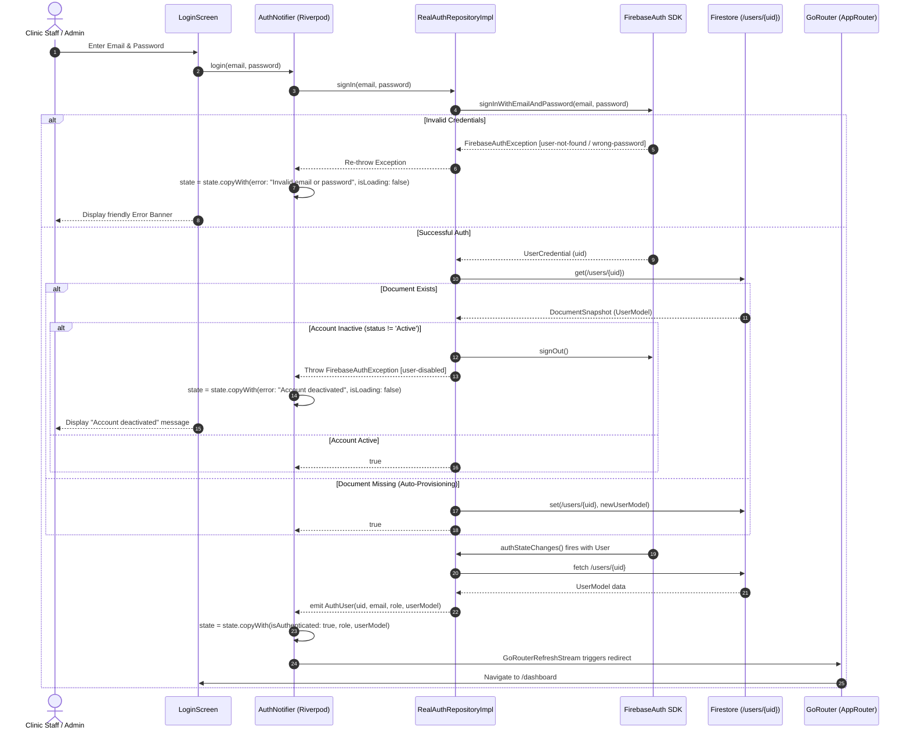

# Firebase Authentication & Role-Based Access Control (RBAC) Flow

## 1. Overview & Architecture

The **SAEED PHYSIO & REHAB CLINIC** management web application uses **Firebase Authentication** (`firebase_auth: ^5.4.0`) combined with **Cloud Firestore** for user profile and authorization persistence.

The authentication subsystem is designed with a repository-pattern abstraction ([`AuthRepository`](file:///e:/repeat%20project/Physio%20Therapy%20Clinic%20Web%20App%205.0%20-%20Copy%2011/lib/features/auth/data/auth_repository.dart#L21)) managed by Riverpod's [`authRepositoryProvider`](file:///e:/repeat%20project/Physio%20Therapy%20Clinic%20Web%20App%205.0%20-%20Copy%2011/lib/features/auth/data/auth_repository.dart#L219) and [`authProvider`](file:///e:/repeat%20project/Physio%20Therapy%20Clinic%20Web%20App%205.0%20-%20Copy%2011/lib/features/auth/providers/auth_provider.dart#L134).

The system supports two execution paradigms:
1. **Production Mode ([`RealAuthRepositoryImpl`](file:///e:/repeat%20project/Physio%20Therapy%20Clinic%20Web%20App%205.0%20-%20Copy%2011/lib/features/auth/data/auth_repository.dart#L31))**: Directly binds to live Firebase Authentication and queries `/users/{uid}` in Cloud Firestore.
2. **Demo / Offline Mock Mode ([`MockAuthRepositoryImpl`](file:///e:/repeat%20project/Physio%20Therapy%20Clinic%20Web%20App%205.0%20-%20Copy%2011/lib/features/auth/data/auth_repository.dart#L130))**: Operates independently of network connectivity, using local mock credentials and synchronizing session state with browser `localStorage` via [`package:web`](file:///e:/repeat%20project/Physio%20Therapy%20Clinic%20Web%20App%205.0%20-%20Copy%2011/lib/core/utils/local_storage_web.dart#L1).

---

## 2. Authentication Flow Sequence Diagram



---

## 3. Login & Signup Mechanisms

### 3.1 Primary Sign-In
- **Method**: Email & Password (`_auth.signInWithEmailAndPassword(email, password)`).
- **Location**: [`RealAuthRepositoryImpl.signIn`](file:///e:/repeat%20project/Physio%20Therapy%20Clinic%20Web%20App%205.0%20-%20Copy%2011/lib/features/auth/data/auth_repository.dart#L36).
- **Error Normalization**: Raw Firebase codes (`user-not-found`, `wrong-password`, `invalid-credential`, `network-request-failed`) are converted to user-friendly messages in [`AuthNotifier.login`](file:///e:/repeat%20project/Physio%20Therapy%20Clinic%20Web%20App%205.0%20-%20Copy%2011/lib/features/auth/providers/auth_provider.dart#L88).

### 3.2 Staff Provisioning (Secondary Firebase App Pattern)
In client-side web applications, calling `FirebaseAuth.instance.createUserWithEmailAndPassword()` immediately signs the current user out and authenticates the newly created account. 

To prevent an Admin from being signed out when registering a new therapist, the application uses the **Secondary Firebase App Pattern** in [`StaffService.addStaff`](file:///e:/repeat%20project/Physio%20Therapy%20Clinic%20Web%20App%205.0%20-%20Copy%2011/lib/features/staff/providers/staff_provider.dart#L65):

```dart
// 1. Initialize an isolated secondary Firebase app instance
FirebaseApp secondaryApp;
try {
  secondaryApp = Firebase.app('SecondaryApp');
} catch (e) {
  secondaryApp = await Firebase.initializeApp(
    name: 'SecondaryApp',
    options: Firebase.app().options,
  );
}

// 2. Obtain an independent auth instance tied solely to the secondary app
final secondaryAuth = FirebaseAuth.instanceFor(app: secondaryApp);

// 3. Create the staff user account without affecting the primary session
final userCredential = await secondaryAuth.createUserWithEmailAndPassword(
  email: staff.email,
  password: password,
);

final uid = userCredential.user!.uid;

// 4. Write user document to Cloud Firestore
await _firestore.collection('users').doc(uid).set(newStaff.toMap());

// 5. Sign out only the secondary auth instance
await secondaryAuth.signOut();
```

---

## 4. Role Management & Role-Based Access Control (RBAC)

The application supports two distinct roles:
1. **Admin**: Clinic owner/administrator with unrestricted access to all patients, sessions, billing, revenue analytics, staff accounts, salary calculations, and system audit logs.
2. **Therapist**: Physiotherapist with scoped access to their assigned patients, their conducted sessions, and their individual commission salary earnings.

### 4.1 Role Detection & Storage
A user's role is established and validated through three complementary layers:

1. **Firestore `/users/{uid}` Document**:
   The `role` field in the user document holds `'Admin'` or `'Therapist'`.
2. **Auth Token Email Heuristic (Fallback)**:
   If a user document is absent, [`RealAuthRepositoryImpl`](file:///e:/repeat%20project/Physio%20Therapy%20Clinic%20Web%20App%205.0%20-%20Copy%2011/lib/features/auth/data/auth_repository.dart#L63) uses:
   - Any email containing `admin` or matching `admin@physioclinic.com` / `admin@clinic.com` is granted `'Admin'`.
   - All other accounts default to `'Therapist'`.
3. **Firestore Security Rules**:
   `isAdmin()` checks both token email patterns and the Firestore `/users/{uid}` document data.

### 4.2 Role Permissions Matrix

| Feature / Screen | Admin | Therapist | Implementation Details |
| :--- | :---: | :---: | :--- |
| `/dashboard` Overview | Full Clinic | Scoped | Therapists only see their patients, sessions, and personalized salary card. |
| Therapist Salary Calculation | All Staff | Self Only | Displays commission breakdown based on `revenuePercentage`. |
| `/patients` Directory | All Patients | Assigned Only | Filtered by `assignedTherapistId` and `tempTherapistId`. |
| Consultation Fee Tracking | Read/Write | Hidden | Only Admin manages initial consultation fees. |
| `/sessions` Conducted Logs | All Sessions | Assigned Only | Filtered by `therapistId`. |
| `/billing` & Accounts | Full Access | Therapy Only | Massage Chair bills and consultation dues restricted to Admin. |
| `/staff` Management | Full Access | Blocked | Navigation guarded by GoRouter redirect logic. |
| Temporary Patient Reassignment | Full Access | Blocked | Only Admin can execute and revert reassignments. |
| `/reports` Analytics & Export | Full Access | Scoped | Staff Salary Reports available exclusively to Admin. |
| `/activity-logs` Audit Trail | Full Access | Blocked | Guarded by GoRouter and Firestore rules. |

---

## 5. Session Management & State Synchronization

### 5.1 AuthState Structure
Maintained in [`lib/features/auth/providers/auth_provider.dart`](file:///e:/repeat%20project/Physio%20Therapy%20Clinic%20Web%20App%205.0%20-%20Copy%2011/lib/features/auth/providers/auth_provider.dart#L6):
```dart
class AuthState {
  final bool isAuthenticated;
  final String email;
  final String role; // 'Admin' or 'Therapist'
  final UserModel? userModel;
  final String? error;
  final bool isLoading;
}
```

### 5.2 Real-time Session Subscription
The [`AuthNotifier`](file:///e:/repeat%20project/Physio%20Therapy%20Clinic%20Web%20App%205.0%20-%20Copy%2011/lib/features/auth/providers/auth_provider.dart#L53) listens to `_authRepository.authStateChanges()`:
- When a user logs in or a session refreshes, `doc.data()` from `/users/{uid}` is parsed into a [`UserModel`](file:///e:/repeat%20project/Physio%20Therapy%20Clinic%20Web%20App%205.0%20-%20Copy%2011/lib/models/user_model.dart#L3) and attached to `AuthState`.
- If `/users/{uid}` is deactivated (`status != 'Active'`), the user is immediately signed out.
- On sign-out, state is reverted to unauthenticated defaults.

### 5.3 Offline / Demo Session Persistence
In Demo Mode, session state is persisted across page reloads using browser local storage:
- Key: `mock_auth_email`
- Utility: [`local_storage_web.dart`](file:///e:/repeat%20project/Physio%20Therapy%20Clinic%20Web%20App%205.0%20-%20Copy%2011/lib/core/utils/local_storage_web.dart) leveraging `web.window.localStorage`.
- Stored credentials:
  - Admin: `admin@physioclinic.com` / `admin123`
  - Therapist: `therapist@physioclinic.com` / `therapist123`

---

## 6. Post-Authentication Data Seeding & Provisioning

1. **Auto-Document Creation**:
   If a user successfully authenticates via Firebase Auth but no Firestore document exists at `/users/{uid}`, [`RealAuthRepositoryImpl.signIn`](file:///e:/repeat%20project/Physio%20Therapy%20Clinic%20Web%20App%205.0%20-%20Copy%2011/lib/features/auth/data/auth_repository.dart#L60) immediately writes a base profile:
   ```dart
   final newUser = UserModel(
     userId: uid,
     fullName: isAdmin ? 'Clinic Admin' : 'Therapist',
     email: userEmail,
     phone: '',
     role: isAdmin ? 'Admin' : 'Therapist',
     status: 'Active',
     createdAt: DateTime.now(),
     revenuePercentage: isAdmin ? 0.0 : 30.0,
   );
   await _firestore.collection('users').doc(uid).set(newUser.toMap());
   ```

2. **Database Seeding Utility**:
   For fresh deployments, the project provides [`firebase_setup.js`](file:///e:/repeat%20project/Physio%20Therapy%20Clinic%20Web%20App%205.0%20-%20Copy%2011/firebase_setup.js), a Node.js script using the Firebase Admin SDK to seed standard patient profiles (`PT-001` through `PT-004`) and multiple session records with paid/unpaid statuses.
