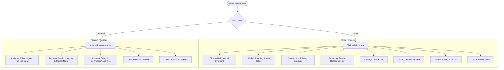
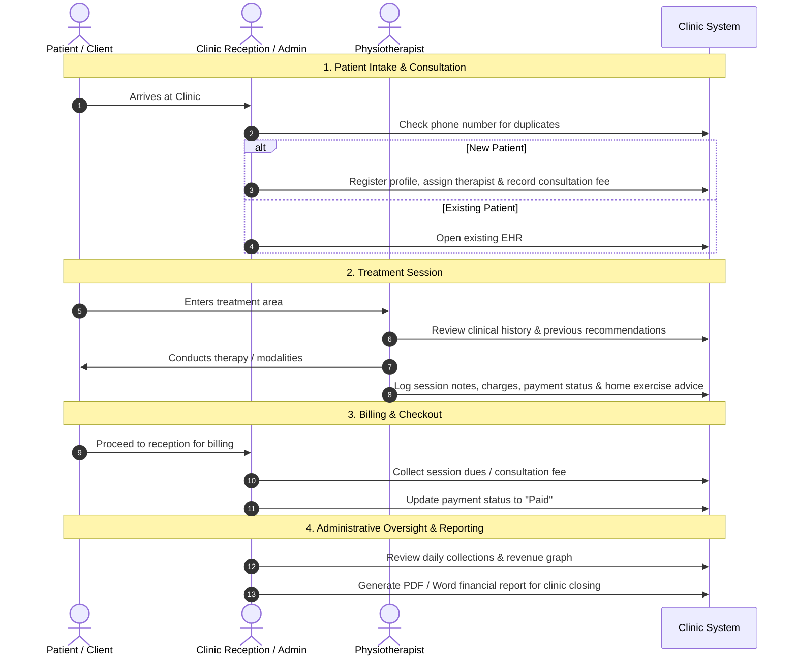

# Project Requirements & Functional Specifications

## 1. Executive Summary & Clinic Overview

**SAEED PHYSIO & REHAB CLINIC** is a specialized clinic management web application engineered for physiotherapy centers, rehabilitation clinics, and wellness facilities.

The platform provides an end-to-end digital operating environment for clinic owners (Admins) and physiotherapists (Staff). It streamlines the complete clinical lifecycle—from initial patient intake and doctor consultations to treatment procedures, temporary staff coverage, dual-service billing (physiotherapy and automated massage chair services), therapist commission calculations, and multi-format document generation (PDF and Word).

---

## 2. Core User Roles & Access Control

The application implements a two-tier Role-Based Access Control (RBAC) model:

### Role Matrix:
1. **Clinic Administrator (`Admin`)**:
   - Complete clinic-wide visibility across all patients, sessions, therapists, and revenues.
   - Manages staff accounts, credentials, and individual commission percentages (`revenuePercentage`).
   - Executes and reverts temporary patient reassignments between therapists.
   - Manages walk-in massage chair customers and billing.
   - Records and tracks doctor consultation fees.
   - Inspects the full system audit log (`activity_logs`).
2. **Physiotherapist (`Therapist`)**:
   - Scoped access to patients primarily assigned to them or temporarily transferred to their care.
   - Conducts therapy sessions, documents treatment notes, and updates payment statuses.
   - Views their personalized real-time commission earnings card on the dashboard.
   - Restricted from viewing other therapists' accounts, administrative logs, or massage chair revenues.

---

## 3. Comprehensive Feature Specifications

### 3.1 Patient Registry & Electronic Health Records (EHR)
- **Central Patient Registry**: Searchable directory displaying patient name, contact number, age, gender, address, medical condition, and assigned therapist.
- **Unified Profile System**: Supports both specialized physical therapy patients and walk-in massage chair customers within a single registry.
- **Duplicate Registration Safeguard**: Real-time validation checks the patient roster for duplicate phone numbers prior to registration, preventing accidental duplicate patient records.
- **EHR & Treatment History**: Dedicated patient profile view detailing historical sessions, treatments received, cumulative charges, and outstanding dues.

### 3.2 Doctor Consultation & Fee Waiver Management
- **Consultation Fee Tracking**: Records initial medical examination charges, clearing dates, and clinical notes.
- **Charity / Fee Waiver Support**: Full support for non-paying, charitable, or discounted cases (`isFeeWaiver = true` / `paymentStatus = 'Fee Waiver'`). Dues calculations automatically accommodate fee waivers without skewing outstanding balances.

### 3.3 Therapy Session Tracking & Clinical Notes
- **Detailed Clinical Logging**: Documents specific therapeutic modalities, manual therapy techniques, dry needling, traction, and exercise prescriptions in `treatmentNotes`.
- **Treatment Continuity**: Includes a `nextRecommendation` field for home exercise programs (HEP) and follow-up intervals.
- **Flexible Billing Status**: Each session tracks financial charges and one of three payment states: `Paid`, `Unpaid`, or `Fee Waiver`.

### 3.4 Dual-Service Billing (Therapy & Massage Chair)
- **Massage Chair Service Module**: Tracks walk-in clients utilizing the clinic's automated massage chairs with customizable session durations (e.g., 30 mins, 45 mins) and fees.
- **Isolated Financial Streams**: Massage chair revenue is tracked independently from clinical physiotherapy, ensuring accurate clinical analytics while maintaining combined gross revenue metrics.

### 3.5 Staff Management & Commission Engine
- **Staff Directory**: Manages therapist credentials, qualifications (e.g. DPT, CMPT), specializations (e.g. Orthopedic Spine, Pediatric Rehabilitation), and employment status.
- **Commission-Based Revenue Sharing**: Each therapist has a configurable `revenuePercentage` (e.g., 30%, 35%, 40%).
- **Automated Salary Calculation**:
  $$\text{Therapist Earnings} = \sum (\text{Paid Therapy Charges}) \times \left(\frac{\text{revenuePercentage}}{100}\right)$$
  - Therapists view their live earnings, completed sessions, and current month accruals on their dashboard.
  - Admins view a clinic-wide staff salary card summarizing earnings per therapist across custom date ranges.
- **Soft-Delete Account Retention**: Deactivating a therapist flags their record as `status = 'Deleted'` and `isDeleted = true`. This preserves all historical clinical logs, session records, and billing data for medical-legal compliance.

### 3.6 Temporary Patient Reassignment Engine
- **Coverage Handover Workflow**: When a therapist is on leave, an Admin can transfer their patients to a covering therapist.
- **Time-Bounded Validity**: Includes planned `startDate` and `endDate`.
- **Dual-Stream Visibility**: The covering therapist's patient list automatically merges their own patients with temporarily assigned patients.
- **Auto-Reversion Watchdog**: An automated background provider ([`autoReversionCheckerProvider`](file:///e:/repeat%20project/Physio%20Therapy%20Clinic%20Web%20App%205.0%20-%20Copy%2011/lib/features/staff/providers/reassignment_provider.dart#L282)) monitors active assignments and automatically reverts patients back to their original therapist once the end date passes.
- **Manual Reversion**: Admins can manually revert any assignment at any time with a single click.

### 3.7 Accounts & Outstanding Dues Management
- **Centralized Billing Hub**: Unified view of all outstanding accounts receivable across therapy sessions, massage chair services, and consultation fees.
- **Instant Status Toggling**: Mark dues as `Paid` directly from billing tables or patient detail views.
- **Real-Time Financial Totals**: Summarizes Total Charges, Total Collected, and Net Outstanding Dues.

### 3.8 Executive Dashboard & Analytics
- **Summary Metric Cards**: Live counters for Total Patients, Conducted Sessions, Massage Chair Sessions, Consultation Records, Therapy Revenue, Chair Revenue, Consultation Revenue, Gross Clinic Earnings, and Pending Dues.
- **Interactive Revenue Charts**: Weekly and monthly revenue graphs built with `fl_chart: ^0.66.0`.
- **Recent Activity Split**: Quick-access lists for recent patient check-ins and latest treatment logs.

### 3.9 Multi-Format Reporting & Export Engine
- **Customizable Report Views**:
  - Revenue & Collections Summary
  - Outstanding Dues Summary
  - Patient Registrations Directory
  - Therapy Session Activity Logs
  - Staff Salary & Commission Breakdowns (Admin Only)
- **Time Filtering**: Toggle between Daily, Weekly, and Monthly timeframes.
- **In-App Print Preview**: Modal preview before printing or saving.
- **Client-Side PDF Generation**: High-resolution branded clinic PDFs using `pdf: ^3.12.0` and `printing: ^5.14.3`.
- **Microsoft Word Export**: Generates `.docx` documents using `docx_creator: ^1.2.7`.
- **Native Sharing**: Shares generated reports across email or messaging apps via `share_plus: ^13.1.0`.

### 3.10 System Activity Audit Trail
- **Comprehensive Logging**: Every significant clinic event (patient registration, profile update, session addition, temporary transfer, reversion, staff creation, staff deactivation) writes an immutable record to the `activity_logs` collection.
- **Audit Detail**: Records the acting user's name, role, timestamp, action type, and detailed description.

---

## 4. Operational Clinic Workflows

---

## 5. Technology Stack Summary

| Layer | Component | Version / Specification |
| :--- | :--- | :--- |
| **Framework** | Flutter Web & Multiplatform | Dart SDK `^3.11.1` |
| **State Management** | Flutter Riverpod | `^2.5.1` |
| **Routing** | GoRouter | `^14.2.0` |
| **Cloud Database** | Google Cloud Firestore | `^5.6.0` |
| **Authentication** | Firebase Authentication | `^5.4.0` |
| **Core Firebase** | Firebase Core | `^3.15.2` |
| **Charts & Analytics** | FL Chart | `^0.66.0` |
| **Document Generation** | PDF & Printing | `pdf: ^3.12.0`, `printing: ^5.14.3` |
| **Word Generation** | Docx Creator | `docx_creator: ^1.2.7` |
| **Sharing** | Share Plus | `share_plus: ^13.1.0` |
| **Web Platform Bridge** | Package Web | `web: ^1.1.0` |
| **Internationalization** | Intl | `^0.19.0` |
