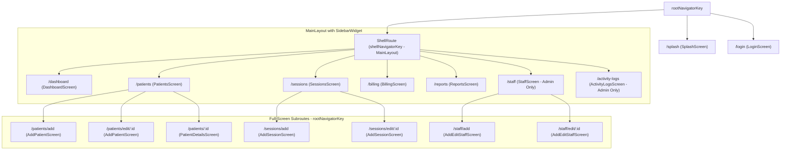
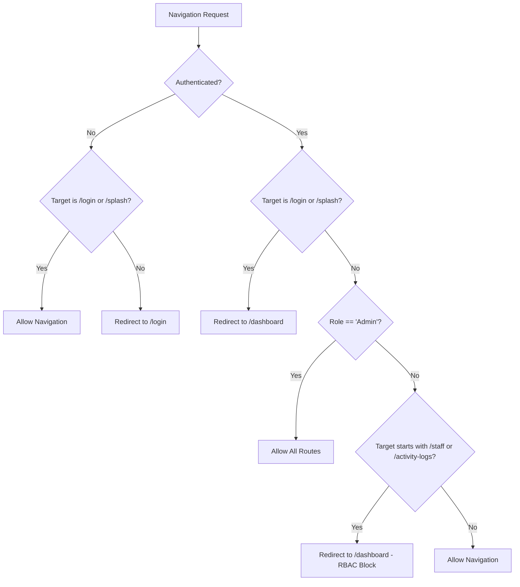

# Routing & Navigation Architecture

## 1. Routing Solution Identification

The **SAEED PHYSIO & REHAB CLINIC** application uses **GoRouter** (`go_router: ^14.2.0`) as its declarative, URL-based routing and navigation solution.

### Key Architectural Advantages:
- **Web-First Support**: Fully synchronizes with the browser's address bar, history stack, and deep-linking URLs.
- **Hierarchical Layouts via `ShellRoute`**: Preserves the persistent sidebar navigation layout across page transitions without rebuild flicker.
- **Declarative Navigation Guards**: Centralized `redirect` callback handling authentication and Role-Based Access Control (RBAC).
- **Reactive Navigation State**: Dynamically reacts to Firebase Auth state emissions via a custom `GoRouterRefreshStream`.

The router configuration is injected into the application tree in [`lib/main.dart`](file:///e:/repeat%20project/Physio%20Therapy%20Clinic%20Web%20App%205.0%20-%20Copy%2011/lib/main.dart#L27) through [`routerProvider`](file:///e:/repeat%20project/Physio%20Therapy%20Clinic%20Web%20App%205.0%20-%20Copy%2011/lib/routes/app_router.dart#L29).

---

## 2. Navigation Architecture & Route Hierarchy



---

## 3. Route Catalog & Parameter Passing

Configured in [`lib/routes/app_router.dart`](file:///e:/repeat%20project/Physio%20Therapy%20Clinic%20Web%20App%205.0%20-%20Copy%2011/lib/routes/app_router.dart):

### 3.1 Standalone Root Routes
Rendered directly onto `rootNavigatorKey` without the persistent layout shell:

| Path | Screen Widget | Access Control | Purpose |
| :--- | :--- | :--- | :--- |
| `/splash` | [`SplashScreen`](file:///e:/repeat%20project/Physio%20Therapy%20Clinic%20Web%20App%205.0%20-%20Copy%2011/lib/features/dashboard/screens/splash_screen.dart) | Public | Initial entry animation and session check. |
| `/login` | [`LoginScreen`](file:///e:/repeat%20project/Physio%20Therapy%20Clinic%20Web%20App%205.0%20-%20Copy%2011/lib/features/auth/screens/login_screen.dart) | Public | Email/Password sign-in and Demo bypass. |

---

### 3.2 Shell Routes (Nested inside `MainLayout`)
Rendered inside [`ShellRoute`](file:///e:/repeat%20project/Physio%20Therapy%20Clinic%20Web%20App%205.0%20-%20Copy%2011/lib/routes/app_router.dart#L48) onto `shellNavigatorKey`. The [`MainLayout`](file:///e:/repeat%20project/Physio%20Therapy%20Clinic%20Web%20App%205.0%20-%20Copy%2011/lib/core/widgets/sidebar_widget.dart#L13) provides the persistent responsive sidebar:

| Path | Screen Widget | Access Level | Description & Arguments |
| :--- | :--- | :--- | :--- |
| `/dashboard` | [`DashboardScreen`](file:///e:/repeat%20project/Physio%20Therapy%20Clinic%20Web%20App%205.0%20-%20Copy%2011/lib/features/dashboard/screens/dashboard_screen.dart) | Authenticated | Executive metrics, charts, therapist commission cards. |
| `/patients` | [`PatientsScreen`](file:///e:/repeat%20project/Physio%20Therapy%20Clinic%20Web%20App%205.0%20-%20Copy%2011/lib/features/patients/screens/patients_screen.dart) | Authenticated | Searchable directory of clinic patients and chair clients. |
| `/sessions` | [`SessionsScreen`](file:///e:/repeat%20project/Physio%20Therapy%20Clinic%20Web%20App%205.0%20-%20Copy%2011/lib/features/sessions/screens/sessions_screen.dart) | Authenticated | Clinical session logs timeline and filters. |
| `/billing` | [`BillingScreen`](file:///e:/repeat%20project/Physio%20Therapy%20Clinic%20Web%20App%205.0%20-%20Copy%2011/lib/features/billing/screens/billing_screen.dart) | Authenticated | Accounts, pending dues collection, chair invoices. |
| `/reports` | [`ReportsScreen`](file:///e:/repeat%20project/Physio%20Therapy%20Clinic%20Web%20App%205.0%20-%20Copy%2011/lib/features/reports/screens/reports_screen.dart) | Authenticated | Print preview, PDF/Word generation, sharing. |
| `/staff` | [`StaffScreen`](file:///e:/repeat%20project/Physio%20Therapy%20Clinic%20Web%20App%205.0%20-%20Copy%2011/lib/features/staff/screens/staff_screen.dart) | **Admin Only** | Staff directory and temporary patient reassignments. |
| `/activity-logs` | [`ActivityLogsScreen`](file:///e:/repeat%20project/Physio%20Therapy%20Clinic%20Web%20App%205.0%20-%20Copy%2011/lib/features/reports/screens/activity_logs_screen.dart) | **Admin Only** | Clinic mutation history and audit logs. |

---

### 3.3 Subroutes & Parameter Extraction

Subroutes are structured hierarchically under their parent resources. When opened, modal routes target `parentNavigatorKey: rootNavigatorKey` to cover the sidebar:

#### 1. Patient Subroutes:
- **Add Patient**: `/patients/add`
  - Target: `rootNavigatorKey`
  - Widget: `AddPatientScreen()`
- **Edit Patient**: `/patients/edit/:id`
  - Target: `rootNavigatorKey`
  - Path Parameter: `:id` via `state.pathParameters['id']!`
  - Extra Argument: `state.extra as PatientModel?` (provides immediate data rendering before network fetch)
- **Patient Details**: `/patients/:id`
  - Target: `shellNavigatorKey`
  - Path Parameter: `:id` via `state.pathParameters['id']!`
  - Widget: `PatientDetailsScreen(patientId: patientId)`

#### 2. Session Subroutes:
- **Add Session**: `/sessions/add`
  - Target: `rootNavigatorKey`
  - Query Parameter: `?patientId=...` extracted via `state.uri.queryParameters['patientId']`
  - Widget: `AddSessionScreen(initialPatientId: initialPatientId)`
- **Edit Session**: `/sessions/edit/:id`
  - Target: `rootNavigatorKey`
  - Path Parameter: `:id` via `state.pathParameters['id']!`
  - Extra Argument: `state.extra as SessionModel?`

#### 3. Staff Subroutes:
- **Add Staff**: `/staff/add`
  - Target: `rootNavigatorKey`
  - Widget: `AddEditStaffScreen()`
- **Edit Staff**: `/staff/edit/:id`
  - Target: `rootNavigatorKey`
  - Path Parameter: `:id` via `state.pathParameters['id']!`
  - Extra Argument: `state.extra as UserModel?`

---

## 4. Middleware, Navigation Guards & RBAC

All incoming navigation events pass through GoRouter's declarative `redirect` callback in [`app_router.dart`](file:///e:/repeat%20project/Physio%20Therapy%20Clinic%20Web%20App%205.0%20-%20Copy%2011/lib/routes/app_router.dart#L143):



### Guard Implementation:
```dart
redirect: (context, state) {
  final isLoggingIn = state.uri.path == '/login';
  final isSplash = state.uri.path == '/splash';

  // 1. Unauthenticated Guard
  if (!authState.isAuthenticated && !isLoggingIn && !isSplash) {
    return '/login';
  }

  // 2. Already Authenticated Guard
  if (authState.isAuthenticated && (isLoggingIn || isSplash)) {
    return '/dashboard';
  }
  
  // 3. RBAC Admin Guard
  if (authState.isAuthenticated && authState.role != 'Admin') {
     if (state.uri.path.startsWith('/staff') || state.uri.path.startsWith('/activity-logs')) {
         return '/dashboard'; // Block unauthorized therapist access
     }
  }

  return null; // Permit navigation
},
```

---

## 5. Reactive Route Refreshing

To prevent stale navigation state when a user signs in, logs out, or their account is deactivated, GoRouter connects directly to the authentication stream using [`GoRouterRefreshStream`](file:///e:/repeat%20project/Physio%20Therapy%20Clinic%20Web%20App%205.0%20-%20Copy%2011/lib/routes/app_router.dart#L167):

```dart
class GoRouterRefreshStream extends ChangeNotifier {
  late final StreamSubscription<dynamic> _subscription;

  GoRouterRefreshStream(Stream<dynamic> stream) {
    notifyListeners();
    _subscription = stream.listen((_) => notifyListeners());
  }

  @override
  void dispose() {
    _subscription.cancel();
    super.dispose();
  }
}
```

By supplying `refreshListenable: GoRouterRefreshStream(authRepository.authStateChanges())`, GoRouter re-evaluates the `redirect` function instantaneously upon any login or logout event across the app.
