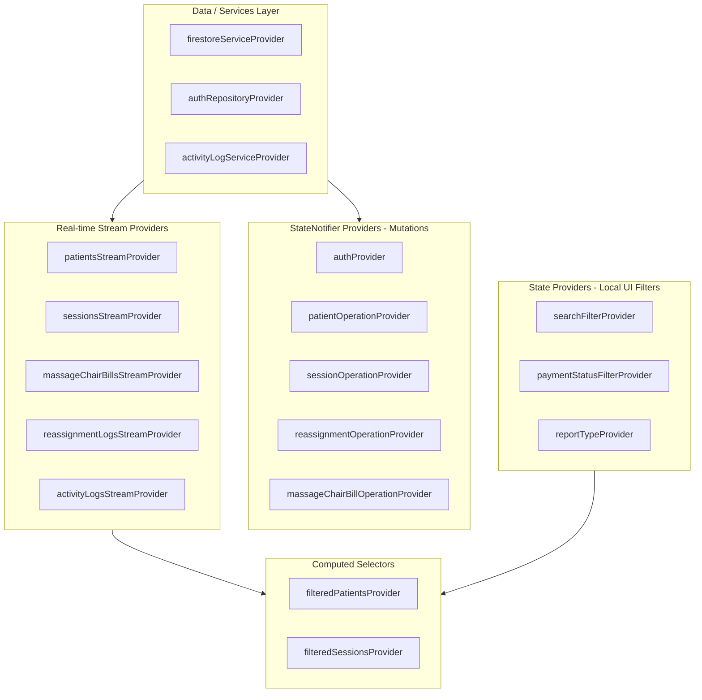

# State Management Architecture

## 1. State Management Solution Identification

The **SAEED PHYSIO & REHAB CLINIC** application exclusively uses **Flutter Riverpod** (`flutter_riverpod: ^2.5.1`) for state management, dependency injection, and reactive data synchronization.

### Why Riverpod was Chosen:
- **Compile-time Safety**: No `ProviderNotFoundException` runtime crashes.
- **First-class Reactive Streams**: Native integration with Firestore real-time streams via `StreamProvider`.
- **Decoupled Architecture**: Logic and state notifiers exist outside the widget tree and can be easily mocked, tested, or inspected.
- **Fine-grained Reactivity**: Widgets only re-render when specifically observed properties change (via `ref.watch`).

The root of the application is wrapped in a [`ProviderScope`](file:///e:/repeat%20project/Physio%20Therapy%20Clinic%20Web%20App%205.0%20-%20Copy%2011/lib/main.dart#L16) in `main.dart`:

```dart
void main() async {
  WidgetsFlutterBinding.ensureInitialized();
  await FirebaseService.initialize();

  runApp(
    const ProviderScope(
      child: PhysioClinicApp(),
    ),
  );
}
```

---

## 2. Directory Structure & Naming Conventions

State files are organized following a **Feature-First** convention. Every functional domain maintains a dedicated `providers/` directory:

```
lib/
├── core/
│   └── services/
│       ├── firebase_service.dart
│       ├── firestore_service.dart      --> firestoreServiceProvider
│       └── activity_log_service.dart    --> activityLogServiceProvider
├── routes/
│   └── app_router.dart                 --> routerProvider
└── features/
    ├── auth/
    │   ├── data/auth_repository.dart    --> authRepositoryProvider
    │   └── providers/
    │       └── auth_provider.dart       --> authProvider
    ├── billing/
    │   └── providers/
    │       └── massage_chair_provider.dart --> massageChairBillsStreamProvider,
    │                                          massageChairBillOperationProvider
    ├── patients/
    │   └── providers/
    │       └── patients_provider.dart   --> patientsStreamProvider,
    │                                       allPatientsStreamProvider,
    │                                       patientOperationProvider,
    │                                       searchFilterProvider,
    │                                       filteredPatientsProvider
    ├── reports/
    │   └── providers/
    │       └── activity_logs_provider.dart --> activityLogsStreamProvider
    ├── sessions/
    │   └── providers/
    │       └── sessions_provider.dart   --> sessionsStreamProvider,
    │                                       patientSessionsStreamProvider,
    │                                       sessionOperationProvider,
    │                                       filteredSessionsProvider
    └── staff/
        └── providers/
            ├── staff_provider.dart      --> staffProvider, staffServiceProvider
            └── reassignment_provider.dart --> reassignmentLogsStreamProvider,
                                              reassignmentOperationProvider,
                                              autoReversionCheckerProvider
```

### Naming Conventions:
- **Streams**: Suffix `StreamProvider` (e.g., `patientsStreamProvider`, `sessionsStreamProvider`).
- **Operation Notifiers**: Suffix `OperationNotifier` paired with `State` class (e.g., `PatientOperationNotifier`, `PatientOperationState`).
- **Operation Providers**: Suffix `OperationProvider` (e.g., `patientOperationProvider`).
- **Filters/Selections**: Suffix `FilterProvider` (e.g., `searchFilterProvider`, `paymentStatusFilterProvider`).
- **Services/Repositories**: Suffix `ServiceProvider` or `RepositoryProvider` (e.g., `firestoreServiceProvider`, `authRepositoryProvider`).

---

## 3. Provider Classification & Patterns



### 3.1 `StreamProvider` (Real-Time Firestore Streams)
Pipes real-time Firestore snapshots directly to the UI with automatic connection management, buffering, and error handling.

**Example from [`patients_provider.dart`](file:///e:/repeat%20project/Physio%20Therapy%20Clinic%20Web%20App%205.0%20-%20Copy%2011/lib/features/patients/providers/patients_provider.dart#L11):**
```dart
final patientsStreamProvider = StreamProvider<List<PatientModel>>((ref) {
  final firestoreService = ref.watch(firestoreServiceProvider);
  final authState = ref.watch(authProvider);
  final isAdmin = authState.role == 'Admin';
  final therapistId = isAdmin ? null : authState.userModel?.userId;
  return firestoreService.streamPatients(therapistId: therapistId);
});
```

### 3.2 `StreamProvider.family` (Parameterized Streams)
Dynamically opens streams scoped to a parameter (e.g., a specific patient ID).

**Example from [`sessions_provider.dart`](file:///e:/repeat%20project/Physio%20Therapy%20Clinic%20Web%20App%205.0%20-%20Copy%2011/lib/features/sessions/providers/sessions_provider.dart#L19):**
```dart
final patientSessionsStreamProvider = StreamProvider.family<List<SessionModel>, String>((ref, patientId) {
  final firestoreService = ref.watch(firestoreServiceProvider);
  return firestoreService.streamSessionsForPatient(patientId);
});
```

### 3.3 `StateNotifierProvider` (Asynchronous Mutations & Operation State)
Encapsulates form submissions, API operations, loading spinners, and error alerts into a predictable tripartite state: `{isLoading, error, isSuccess}`.

**Pattern used across Patient, Session, Staff, and Reassignment operations:**
```dart
class PatientOperationState {
  final bool isLoading;
  final String? error;
  final bool isSuccess;

  PatientOperationState({required this.isLoading, this.error, required this.isSuccess});
  factory PatientOperationState.initial() => PatientOperationState(isLoading: false, isSuccess: false);
  
  PatientOperationState copyWith({bool? isLoading, String? error, bool? isSuccess}) {
    return PatientOperationState(
      isLoading: isLoading ?? this.isLoading,
      error: error,
      isSuccess: isSuccess ?? this.isSuccess,
    );
  }
}

class PatientOperationNotifier extends StateNotifier<PatientOperationState> {
  final FirestoreService _firestoreService;
  final ActivityLogService _logService;
  final UserModel? _currentUser;

  PatientOperationNotifier(this._firestoreService, this._logService, this._currentUser)
      : super(PatientOperationState.initial());

  Future<void> addPatient(PatientModel patient) async {
    state = state.copyWith(isLoading: true, error: null, isSuccess: false);
    try {
      await _firestoreService.addPatient(patient);
      // Automatic audit logging
      if (_currentUser != null) {
        await _logService.logActivity(...);
      }
      state = state.copyWith(isLoading: false, isSuccess: true);
    } catch (e) {
      state = state.copyWith(isLoading: false, error: e.toString());
    }
  }
}
```

### 3.4 `StateProvider` (Ephemeral UI State)
Used for fast, local UI filters without boilerplate:
```dart
// Text search filter
final searchFilterProvider = StateProvider<String>((ref) => '');

// Dropdown filters
final paymentStatusFilterProvider = StateProvider<String?>((ref) => null);

// Sidebar collapse toggle
final sidebarExpandedProvider = StateProvider<bool>((ref) => true);
```

### 3.5 Computed Selectors (`Provider<AsyncValue<T>>`)
Combines stream outputs with user filter selections without querying Firestore again.

**Example from [`patients_provider.dart`](file:///e:/repeat%20project/Physio%20Therapy%20Clinic%20Web%20App%205.0%20-%20Copy%2011/lib/features/patients/providers/patients_provider.dart#L130):**
```dart
final filteredPatientsProvider = Provider<AsyncValue<List<PatientModel>>>((ref) {
  final patientsAsync = ref.watch(patientsStreamProvider);
  final searchQuery = ref.watch(searchFilterProvider).toLowerCase().trim();

  return patientsAsync.whenData((patients) {
    if (searchQuery.isEmpty) return patients;
    return patients.where((patient) {
      return patient.fullName.toLowerCase().contains(searchQuery) ||
          patient.phone.contains(searchQuery) ||
          patient.medicalCondition.toLowerCase().contains(searchQuery);
    }).toList();
  });
});
```

---

## 4. Complete Inventory of App Providers

| Provider Name | Type | File Location | Purpose |
| :--- | :--- | :--- | :--- |
| `firestoreServiceProvider` | `Provider<FirestoreService>` | `core/services/firestore_service.dart` | Injects Real or Mock Firestore service. |
| `activityLogServiceProvider` | `Provider<ActivityLogService>` | `core/services/activity_log_service.dart` | Injects Real or Mock Activity Logging service. |
| `authRepositoryProvider` | `Provider<AuthRepository>` | `features/auth/data/auth_repository.dart` | Injects Real or Mock Auth repository. |
| `authProvider` | `StateNotifierProvider<AuthNotifier, AuthState>` | `features/auth/providers/auth_provider.dart` | Holds current user, role, and auth status. |
| `routerProvider` | `Provider<GoRouter>` | `routes/app_router.dart` | App-wide router with redirect guards. |
| `patientsStreamProvider` | `StreamProvider<List<PatientModel>>` | `features/patients/providers/patients_provider.dart` | Real-time patients list (role-filtered). |
| `allPatientsStreamProvider` | `StreamProvider<List<PatientModel>>` | `features/patients/providers/patients_provider.dart` | Unfiltered patients (used for duplicate phone checks & reassignment). |
| `patientOperationProvider` | `StateNotifierProvider<PatientOperationNotifier, PatientOperationState>` | `features/patients/providers/patients_provider.dart` | Manages patient Add/Edit/Delete actions. |
| `searchFilterProvider` | `StateProvider<String>` | `features/patients/providers/patients_provider.dart` | Holds search query in patient list. |
| `filteredPatientsProvider` | `Provider<AsyncValue<List<PatientModel>>>` | `features/patients/providers/patients_provider.dart` | Memoized patient search result. |
| `sessionsStreamProvider` | `StreamProvider<List<SessionModel>>` | `features/sessions/providers/sessions_provider.dart` | Real-time sessions list (role-filtered). |
| `patientSessionsStreamProvider` | `StreamProvider.family<List<SessionModel>, String>` | `features/sessions/providers/sessions_provider.dart` | Sessions for a specific patient. |
| `sessionOperationProvider` | `StateNotifierProvider<SessionOperationNotifier, SessionOperationState>` | `features/sessions/providers/sessions_provider.dart` | Manages session Add/Edit/Delete actions. |
| `selectedPatientFilterProvider` | `StateProvider<String?>` | `features/sessions/providers/sessions_provider.dart` | Filters session timeline by patient. |
| `paymentStatusFilterProvider` | `StateProvider<String?>` | `features/sessions/providers/sessions_provider.dart` | Filters sessions by Paid/Unpaid/Fee Waiver. |
| `filteredSessionsProvider` | `Provider<AsyncValue<List<SessionModel>>>` | `features/sessions/providers/sessions_provider.dart` | Filtered session list computation. |
| `massageChairBillsStreamProvider`| `StreamProvider<List<MassageChairBillModel>>` | `features/billing/providers/massage_chair_provider.dart` | Real-time massage chair bills (Admin only). |
| `massageChairBillOperationProvider`| `StateNotifierProvider<...>` | `features/billing/providers/massage_chair_provider.dart` | Manages massage chair bill CRUD. |
| `staffProvider` | `StreamProvider<List<UserModel>>` | `features/staff/providers/staff_provider.dart` | Real-time therapist directory. |
| `staffServiceProvider` | `Provider<StaffService>` | `features/staff/providers/staff_provider.dart` | Staff CRUD with secondary Firebase app creation. |
| `reassignmentLogsStreamProvider` | `StreamProvider<List<ReassignmentLogModel>>` | `features/staff/providers/reassignment_provider.dart` | Reassignment audit trail records. |
| `reassignmentOperationProvider` | `StateNotifierProvider<ReassignmentNotifier, ReassignmentState>` | `features/staff/providers/reassignment_provider.dart` | Reassign and revert patients between staff. |
| `autoReversionCheckerProvider` | `Provider.autoDispose<void>` | `features/staff/providers/reassignment_provider.dart` | Background watchdog reverting expired temporary coverage. |
| `activityLogsStreamProvider` | `StreamProvider<List<ActivityLogModel>>` | `features/reports/providers/activity_logs_provider.dart` | System audit logs stream. |
| `billingFilterProvider` | `StateProvider<String?>` | `features/billing/screens/billing_screen.dart` | Unpaid / Paid / Fee Waiver filter. |
| `billingSearchProvider` | `StateProvider<String>` | `features/billing/screens/billing_screen.dart` | Patient search query in billing screen. |
| `billingServiceFilterProvider` | `StateProvider<String>` | `features/billing/screens/billing_screen.dart` | 'all', 'therapy', or 'massage_chair'. |
| `reportTypeProvider` | `StateProvider<ReportType>` | `features/reports/screens/reports_screen.dart` | Active report category. |
| `timeFilterProvider` | `StateProvider<TimeFilter>` | `features/reports/screens/reports_screen.dart` | Daily / Weekly / Monthly timeframe. |
| `sidebarExpandedProvider` | `StateProvider<bool>` | `core/widgets/sidebar_widget.dart` | Responsive sidebar expand/collapse toggle. |

---

## 5. UI to Business Logic Communication

Screens extend [`ConsumerWidget`](file:///e:/repeat%20project/Physio%20Therapy%20Clinic%20Web%20App%205.0%20-%20Copy%2011/lib/features/dashboard/screens/dashboard_screen.dart#L18) or [`ConsumerStatefulWidget`](file:///e:/repeat%20project/Physio%20Therapy%20Clinic%20Web%20App%205.0%20-%20Copy%2011/lib/features/patients/screens/add_patient_screen.dart#L15). Communication follows strict unidirectional data flow:

1. **Reading and Listening**:
   ```dart
   // In build method
   final patientsAsync = ref.watch(filteredPatientsProvider);

   return patientsAsync.when(
     data: (patients) => ListView(...),
     loading: () => const CircularProgressIndicator(),
     error: (err, stack) => Text('Error: $err'),
   );
   ```

2. **Triggering Actions**:
   ```dart
   // In event handlers (e.g. button onPressed)
   final success = await ref.read(patientOperationProvider.notifier).addPatient(newPatient);
   ```

3. **Listening for Side Effects (Snackbars / Navigation)**:
   ```dart
   ref.listen<PatientOperationState>(patientOperationProvider, (previous, next) {
     if (next.isSuccess) {
       ScaffoldMessenger.of(context).showSnackBar(const SnackBar(content: Text('Saved!')));
       context.pop();
     } else if (next.error != null) {
       ScaffoldMessenger.of(context).showSnackBar(SnackBar(content: Text(next.error!)));
     }
   });
   ```
